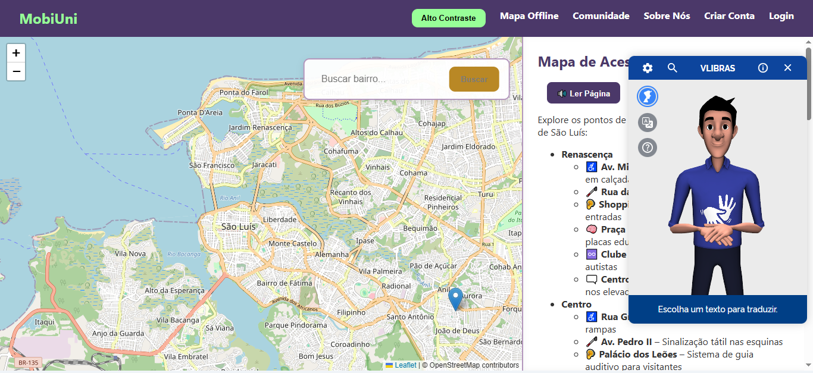

# MobiUni

O **MobiUni** é um sistema web voltado à promoção da mobilidade urbana acessível, especialmente para pessoas com deficiência. A aplicação permite que usuários visualizem, avaliem e compartilhem informações sobre a acessibilidade de locais públicos e privados em suas cidades. Além do mapa com sinalizações personalizadas, o sistema inclui uma rede social integrada, onde os usuários podem fazer postagens, comentar e se conectar com outras pessoas.

## Funções do MobiUni

- **Mapa Interativo Personalizado**: O sistema oferece um mapa dinâmico que é ajustado de acordo com o tipo de deficiência do usuário. Os pontos de acessibilidade são exibidos com filtros específicos, como deficiência visual, auditiva, física, entre outros, proporcionando uma experiência personalizada de acordo com as necessidades do usuário.
  
- **Mapa Offline**: Os usuários podem acessar o mapa e visualizar pontos de acessibilidade mesmo sem conexão com a internet. Isso garante que a aplicação seja útil em áreas com sinal de internet instável ou ausente.
  
- **Avaliação de Locais**: Usuários podem avaliar a acessibilidade de diversos locais, marcando com diferentes tipos de sinalizações (ex: acessível, inacessível ou desconhecido).
- **Rede Social Integrada**: O MobiUni possui uma funcionalidade de rede social onde os usuários podem:
    - Fazer postagens sobre locais acessíveis ou compartilhar suas experiências.
    - Comentar nas postagens de outros usuários.
    - Conectar-se com outros usuários para trocar informações sobre acessibilidade.
    
- **Cadastro de Pontos Acessíveis**: Os usuários podem cadastrar novos pontos de acessibilidade, compartilhando informações detalhadas sobre os locais com a comunidade.

## Objetivos da Aplicação

- **Oferecer um mapa interativo com filtros por tipo de deficiência**: Permitir que os usuários acessem informações específicas sobre acessibilidade de acordo com suas necessidades.
- **Estimular a colaboração entre os usuários com o compartilhamento de experiências**: Facilitar a troca de informações e a construção de uma rede de apoio entre os usuários.
- **Promover autonomia e inclusão social por meio da tecnologia**: Ajudar as pessoas com deficiência a se deslocarem com mais facilidade e segurança, garantindo que tenham acesso a informações sobre acessibilidade na sua cidade.

## Tecnologias Utilizadas

O projeto MobiUni utiliza as seguintes tecnologias:

### Backend:
- **Spring Boot 3.x**: Framework principal para desenvolvimento da aplicação, fornecendo integração com bancos de dados, segurança e serviços web.
- **Spring Security**: Módulo para autenticação e controle de acesso.
- **JPA (Java Persistence API)**: Para integração com o banco de dados MySQL.
- **MySQL**: Banco de dados relacional para armazenamento de dados.
- **Lombok**: Biblioteca para reduzir a verbosidade do código, gerando automaticamente getters, setters e construtores.

### Frontend:
- **HTML**: Linguagem de marcação usada para estruturar o conteúdo da interface do usuário.
- **CSS**: Usado para estilizar o conteúdo HTML, definindo o layout, cores, fontes e aparência geral da página.
- **Thymeleaf**: Motor de templates para renderização do frontend dinâmico.

### Ferramentas de Desenvolvimento:
- **Spring Boot DevTools**: Ferramentas para facilitar o desenvolvimento, com reinício automático e debug.

**Observação**: Este é um projeto acadêmico em andamento, e algumas funcionalidades podem ainda estar sendo desenvolvidas ou aprimoradas.
